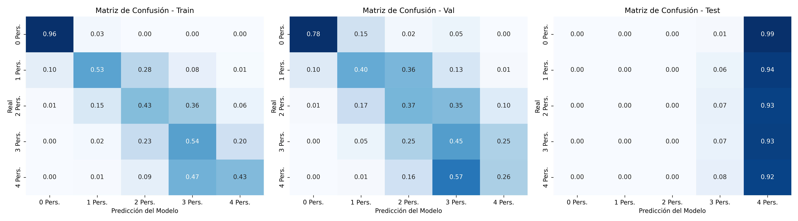
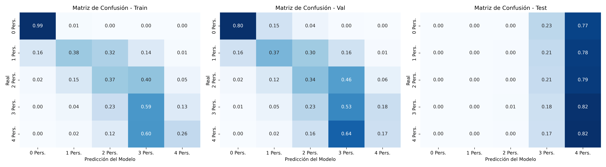

# 📊 Reporte Global de Experimentos: Comparativa y Diagnósticos

Este reporte consolida el rendimiento de los modelos y sus respectivas matrices de confusión por corrida.

## 📋 Tabla Comparativa General

| Experiment                                                                | Model                       | Seed   | Val_Loss   | Val_Acc   |
|:--------------------------------------------------------------------------|:----------------------------|:-------|:-----------|:----------|
| PI_DeepONet_Physics_Rec_0.0_CIR_0.0_Dop_0.0_Seed_42_2026-08-19_07-44-12   | PI-DeepONet_Physics_Fourier | 42     | 1.3212     | 53.86%    |
| PI_DeepONet_Physics_Rec_1.0_CIR_0.01_Dop_0.01_Seed_42_2026-08-19_10-41-50 | PI-DeepONet_Physics_Fourier | 42     | 1.5256     | 53.90%    |
| PI_DeepONet_Physics_Rec_1.0_CIR_0.0_Dop_0.0_Seed_42_2026-08-19_09-13-02   | PI-DeepONet_Physics_Fourier | 42     | 1.5968     | 53.77%    |
| legacy-l_temp-l_empty                                                     | Unknown                     | N/A    | N/A        | N/A       |
| legacy_5-classes-CORAL-l_doppler-l_retardo                                | Unknown                     | N/A    | N/A        | N/A       |
| legacy_5-classes-CORAL-l_ene-l_mono                                       | Unknown                     | N/A    | N/A        | N/A       |
| legacy_9-class_l_ene-l_mono                                               | Unknown                     | N/A    | N/A        | N/A       |
| legacy_single_rx                                                          | Unknown                     | N/A    | N/A        | N/A       |
| validation                                                                | Unknown                     | N/A    | N/A        | N/A       |

## 📈 Matrices de Confusión por Experimento

### PI-DeepONet_Physics_Fourier (Semilla: 42)
- **Carpeta:** `PI_DeepONet_Physics_Rec_0.0_CIR_0.0_Dop_0.0_Seed_42_2026-08-19_07-44-12`
- **Val Loss:** 1.3212 | **Val Acc:** 53.86%

---

### PI-DeepONet_Physics_Fourier (Semilla: 42)
- **Carpeta:** `PI_DeepONet_Physics_Rec_1.0_CIR_0.01_Dop_0.01_Seed_42_2026-08-19_10-41-50`
- **Val Loss:** 1.5256 | **Val Acc:** 53.90%

---

### PI-DeepONet_Physics_Fourier (Semilla: 42)
- **Carpeta:** `PI_DeepONet_Physics_Rec_1.0_CIR_0.0_Dop_0.0_Seed_42_2026-08-19_09-13-02`
- **Val Loss:** 1.5968 | **Val Acc:** 53.77%

---

### Unknown (Semilla: N/A)
- **Carpeta:** `legacy-l_temp-l_empty`
- **Val Loss:** N/A | **Val Acc:** N/A

_No disponible_

---

### Unknown (Semilla: N/A)
- **Carpeta:** `legacy_5-classes-CORAL-l_doppler-l_retardo`
- **Val Loss:** N/A | **Val Acc:** N/A

_No disponible_

---

### Unknown (Semilla: N/A)
- **Carpeta:** `legacy_5-classes-CORAL-l_ene-l_mono`
- **Val Loss:** N/A | **Val Acc:** N/A

_No disponible_

---

### Unknown (Semilla: N/A)
- **Carpeta:** `legacy_9-class_l_ene-l_mono`
- **Val Loss:** N/A | **Val Acc:** N/A

_No disponible_

---

### Unknown (Semilla: N/A)
- **Carpeta:** `legacy_single_rx`
- **Val Loss:** N/A | **Val Acc:** N/A

_No disponible_

---

### Unknown (Semilla: N/A)
- **Carpeta:** `validation`
- **Val Loss:** N/A | **Val Acc:** N/A

_No disponible_

---

