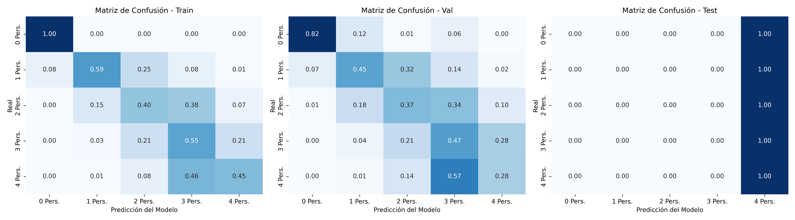
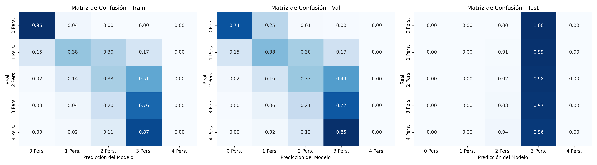
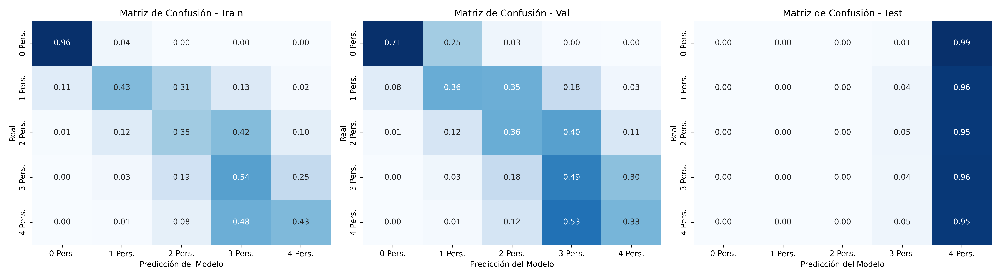
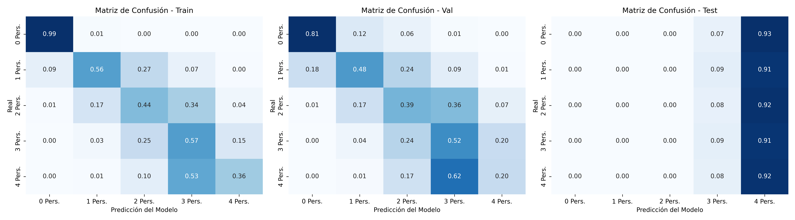
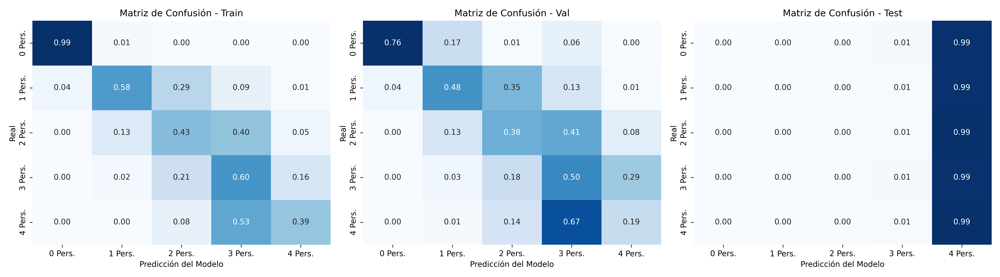
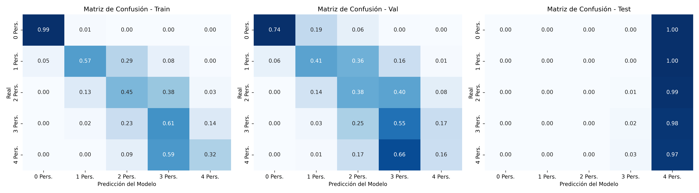

# 📊 Reporte Global de Experimentos: Comparativa y Diagnósticos

Este reporte consolida el rendimiento de los modelos y sus respectivas matrices de confusión por corrida.

## 📋 Tabla Comparativa General

| Experiment                                                                 | Model                       | Seed   | Val_Loss   | Val_Acc   |
|:---------------------------------------------------------------------------|:----------------------------|:-------|:-----------|:----------|
| PI_DeepONet_Physics_Rec_0.0_CIR_0.0_Dop_0.0_Seed_123_2026-08-19_18-13-58   | PI-DeepONet_Physics_Fourier | 123    | 1.3733     | 53.50%    |
| PI_DeepONet_Physics_Rec_0.0_CIR_0.0_Dop_0.0_Seed_42_2026-08-19_07-44-12    | PI-DeepONet_Physics_Fourier | 42     | 1.3212     | 53.86%    |
| PI_DeepONet_Physics_Rec_0.0_CIR_0.0_Dop_0.0_Seed_42_2026-08-19_13-45-02    | PI-DeepONet_Physics_Fourier | 42     | 1.3353     | 55.57%    |
| PI_DeepONet_Physics_Rec_0.0_CIR_0.0_Dop_0.0_Seed_777_2026-08-19_22-43-03   | PI-DeepONet_Physics_Fourier | 777    | 1.1603     | 53.82%    |
| PI_DeepONet_Physics_Rec_1.0_CIR_0.01_Dop_0.01_Seed_123_2026-08-19_21-12-35 | PI-DeepONet_Physics_Fourier | 123    | 1.4888     | 57.60%    |
| PI_DeepONet_Physics_Rec_1.0_CIR_0.01_Dop_0.01_Seed_42_2026-08-19_10-41-50  | PI-DeepONet_Physics_Fourier | 42     | 1.5256     | 53.90%    |
| PI_DeepONet_Physics_Rec_1.0_CIR_0.01_Dop_0.01_Seed_42_2026-08-19_16-43-30  | PI-DeepONet_Physics_Fourier | 42     | 1.5433     | 58.63%    |
| PI_DeepONet_Physics_Rec_1.0_CIR_0.01_Dop_0.01_Seed_777_2026-08-20_01-41-38 | PI-DeepONet_Physics_Fourier | 777    | 1.5032     | 56.68%    |
| PI_DeepONet_Physics_Rec_1.0_CIR_0.0_Dop_0.0_Seed_123_2026-08-19_19-43-13   | PI-DeepONet_Physics_Fourier | 123    | 1.5583     | 53.23%    |
| PI_DeepONet_Physics_Rec_1.0_CIR_0.0_Dop_0.0_Seed_42_2026-08-19_09-13-02    | PI-DeepONet_Physics_Fourier | 42     | 1.5968     | 53.77%    |
| PI_DeepONet_Physics_Rec_1.0_CIR_0.0_Dop_0.0_Seed_42_2026-08-19_15-14-14    | PI-DeepONet_Physics_Fourier | 42     | 1.4359     | 55.38%    |
| PI_DeepONet_Physics_Rec_1.0_CIR_0.0_Dop_0.0_Seed_777_2026-08-20_00-12-18   | PI-DeepONet_Physics_Fourier | 777    | 1.5639     | 54.70%    |
| legacy-l_temp-l_empty                                                      | Unknown                     | N/A    | N/A        | N/A       |
| legacy_5-classes-CORAL-l_doppler-l_retardo                                 | Unknown                     | N/A    | N/A        | N/A       |
| legacy_5-classes-CORAL-l_ene-l_mono                                        | Unknown                     | N/A    | N/A        | N/A       |
| legacy_9-class_l_ene-l_mono                                                | Unknown                     | N/A    | N/A        | N/A       |
| legacy_single_rx                                                           | Unknown                     | N/A    | N/A        | N/A       |
| validation                                                                 | Unknown                     | N/A    | N/A        | N/A       |

## 📈 Matrices de Confusión por Experimento

### PI-DeepONet_Physics_Fourier (Semilla: 123)
- **Carpeta:** `PI_DeepONet_Physics_Rec_0.0_CIR_0.0_Dop_0.0_Seed_123_2026-08-19_18-13-58`
- **Val Loss:** 1.3733 | **Val Acc:** 53.50%

---

### PI-DeepONet_Physics_Fourier (Semilla: 42)
- **Carpeta:** `PI_DeepONet_Physics_Rec_0.0_CIR_0.0_Dop_0.0_Seed_42_2026-08-19_07-44-12`
- **Val Loss:** 1.3212 | **Val Acc:** 53.86%

---

### PI-DeepONet_Physics_Fourier (Semilla: 42)
- **Carpeta:** `PI_DeepONet_Physics_Rec_0.0_CIR_0.0_Dop_0.0_Seed_42_2026-08-19_13-45-02`
- **Val Loss:** 1.3353 | **Val Acc:** 55.57%

---

### PI-DeepONet_Physics_Fourier (Semilla: 777)
- **Carpeta:** `PI_DeepONet_Physics_Rec_0.0_CIR_0.0_Dop_0.0_Seed_777_2026-08-19_22-43-03`
- **Val Loss:** 1.1603 | **Val Acc:** 53.82%

---

### PI-DeepONet_Physics_Fourier (Semilla: 123)
- **Carpeta:** `PI_DeepONet_Physics_Rec_1.0_CIR_0.01_Dop_0.01_Seed_123_2026-08-19_21-12-35`
- **Val Loss:** 1.4888 | **Val Acc:** 57.60%

---

### PI-DeepONet_Physics_Fourier (Semilla: 42)
- **Carpeta:** `PI_DeepONet_Physics_Rec_1.0_CIR_0.01_Dop_0.01_Seed_42_2026-08-19_10-41-50`
- **Val Loss:** 1.5256 | **Val Acc:** 53.90%

---

### PI-DeepONet_Physics_Fourier (Semilla: 42)
- **Carpeta:** `PI_DeepONet_Physics_Rec_1.0_CIR_0.01_Dop_0.01_Seed_42_2026-08-19_16-43-30`
- **Val Loss:** 1.5433 | **Val Acc:** 58.63%

---

### PI-DeepONet_Physics_Fourier (Semilla: 777)
- **Carpeta:** `PI_DeepONet_Physics_Rec_1.0_CIR_0.01_Dop_0.01_Seed_777_2026-08-20_01-41-38`
- **Val Loss:** 1.5032 | **Val Acc:** 56.68%

---

### PI-DeepONet_Physics_Fourier (Semilla: 123)
- **Carpeta:** `PI_DeepONet_Physics_Rec_1.0_CIR_0.0_Dop_0.0_Seed_123_2026-08-19_19-43-13`
- **Val Loss:** 1.5583 | **Val Acc:** 53.23%

---

### PI-DeepONet_Physics_Fourier (Semilla: 42)
- **Carpeta:** `PI_DeepONet_Physics_Rec_1.0_CIR_0.0_Dop_0.0_Seed_42_2026-08-19_09-13-02`
- **Val Loss:** 1.5968 | **Val Acc:** 53.77%

---

### PI-DeepONet_Physics_Fourier (Semilla: 42)
- **Carpeta:** `PI_DeepONet_Physics_Rec_1.0_CIR_0.0_Dop_0.0_Seed_42_2026-08-19_15-14-14`
- **Val Loss:** 1.4359 | **Val Acc:** 55.38%

---

### PI-DeepONet_Physics_Fourier (Semilla: 777)
- **Carpeta:** `PI_DeepONet_Physics_Rec_1.0_CIR_0.0_Dop_0.0_Seed_777_2026-08-20_00-12-18`
- **Val Loss:** 1.5639 | **Val Acc:** 54.70%

---

### Unknown (Semilla: N/A)
- **Carpeta:** `legacy-l_temp-l_empty`
- **Val Loss:** N/A | **Val Acc:** N/A

_No disponible_

---

### Unknown (Semilla: N/A)
- **Carpeta:** `legacy_5-classes-CORAL-l_doppler-l_retardo`
- **Val Loss:** N/A | **Val Acc:** N/A

_No disponible_

---

### Unknown (Semilla: N/A)
- **Carpeta:** `legacy_5-classes-CORAL-l_ene-l_mono`
- **Val Loss:** N/A | **Val Acc:** N/A

_No disponible_

---

### Unknown (Semilla: N/A)
- **Carpeta:** `legacy_9-class_l_ene-l_mono`
- **Val Loss:** N/A | **Val Acc:** N/A

_No disponible_

---

### Unknown (Semilla: N/A)
- **Carpeta:** `legacy_single_rx`
- **Val Loss:** N/A | **Val Acc:** N/A

_No disponible_

---

### Unknown (Semilla: N/A)
- **Carpeta:** `validation`
- **Val Loss:** N/A | **Val Acc:** N/A

_No disponible_

---

